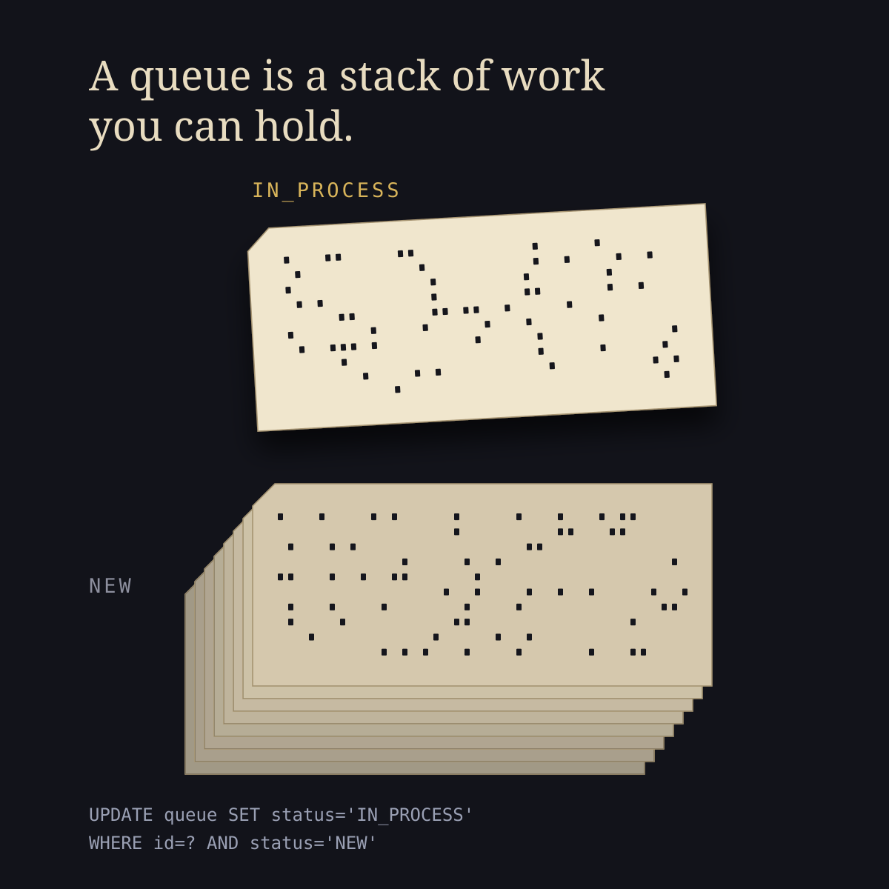

# ljms - a work queue that is one table

A tiny, dependency-free work queue that gives a web application the one thing it lacks: **somewhere to put the slow work**.



A request cannot wait for a report to render or a model to run, so the work has to go somewhere and something has to pick it up. The usual answer is a broker: a service to install, secure, monitor, back up and upgrade, holding a second copy of your state where you cannot join it against your own data. `ljms` is one table in the database you already have, and a loop that polls it. Everything under it is the boring, proven part: a status column, an owner, a lease, and four state names you can read straight out of a `SELECT`. No broker, no dependencies beyond the JDK and a JDBC driver. There is a worker process, but it is your own JVM running your own code, in-process, from cron or under systemd, rather than a service you have to operate. None of it is new: it is essentially a JES job queue on z/OS, an operator's spool of work held as data rather than as process memory, pointed at web applications instead of batch decks.

Some of this the word does by itself. "Queue" has come to name a category of product rather than a shape of data, so "we need a queue" tends to get answered with something you install rather than something you declare. Nobody sets out to over-build. It is just that once the question is which queue, the smallest answer on the shelf is already a service.

This isn't a messaging idea; it's an **optimistic locking** idea. Anyone who has written lock-free code knows the shape: do not take a lock, read a value and swap in a new one only if it has not changed since, and if somebody beat you to it, read again. `UPDATE queue SET status='IN_PROCESS' WHERE id=? AND status='NEW'` is that compare-and-swap, and the affected-row count is its answer. Contention costs a wasted attempt rather than a blocked worker, which is why you can add workers without them queueing behind each other. `ljms` is that one instinct, applied to a table.

```
COMPARE-AND-SWAP  (concurrent code)       OPTIMISTIC LOCKING  (any database)
------------------------------------      -----------------------------------
  old = load(addr)                          task = SELECT ... WHERE status='NEW'
      |                                         |
  new = f(old)                              claim it for this worker
      |                                         |
  CAS(addr, old, new)                       UPDATE ... WHERE id=? AND status='NEW'
      |                                         |
  succeeded? -> it is yours                 1 row  -> it is yours
  failed?    -> somebody else won,          0 rows -> somebody else won,
                read again and retry                  read again and retry
```

It is a template rather than a library. You copy the files into your project, put your work in one empty method, and own the result. There is no jar to depend on and no interface it makes you implement.

```
src/org/ljms/
  Queue.java          the four state names
  Task.java           one row
  Connections.java    the one thing you supply
  Dialect.java        the two SQL expressions that differ between databases
  QueueDAO.java       the SQL
  Processor.java      the loop, with your work() in the middle
```

About 1,100 lines including comments, ~510 excluding comments and blanks. Most of it is explanation.

## Quick start

```sh
mysql mydb < sql/mysql.sql       # or postgres.sql / oracle.sql / mssql.sql
ant                              # compile; JDK only
ant prove                        # check the state machine (no database)
```

Three places are marked `EDIT THESE`, the database constants at the top of `Processor.java`, and the same in `QueueTests.java` and `Bench.java` if you want to run the tests or the benchmark. There is no properties file and no config class: every project already has a way of holding credentials, and a template that insists on its own just leaves you a layer to remove.

Put your work in `Processor.work()`:

```java
protected void work(Task task) throws Exception {
    if ("SEND_REPORT".equals(task.type)) sendReport(task.refId);
    else throw new Exception("Unknown task type: " + task.type);
}
```

Enqueue from anywhere:

```java
Connections db = () -> DriverManager.getConnection(url, user, password);
new QueueDAO(db).put("SEND_REPORT", reportId, null);
```

Run a worker, `./queue.sh start`, from cron, from systemd, or in-process:

```java
Processor worker = new Processor(db);
worker.start();
```

On anything but MySQL, pass the dialect:

```java
QueueDAO queue = new QueueDAO(db, "QUEUE", Dialect.POSTGRES);
Processor worker = new Processor(queue);
```

Your JDBC driver needs to be on the classpath; nothing here bundles one.

The operations are `put`, `take`, `done`, `error`. The first two are the names `java.util.concurrent.BlockingQueue` uses; the other two have no equivalent there, because an in-memory queue has nothing to record. The rest of the surface, `extendLease`, `recoverExpired`, `requeueErrors`, `requeueAllErrors`, `position`, `pending`, `get`, you can ignore until you need it.

## Who does what

```
   your web tier                    the QUEUE table                 workers
   ------------                     ---------------                 -------
   POST /reports  ──put()──────►    NEW                    ◄──take()──  loop
                                      │                                   │
   GET  /reports/42  ──SELECT──►    IN_PROCESS  ◄──────────────────── work()
        (status, no API)              │                                   │
                                    DONE / ERROR           ◄──done()/error()
```

Enqueueing is one call from a servlet. **Showing status is a plain `SELECT`**. There is no client library to install and no second system to reconcile, because the queue is a table in the database your web tier already talks to. This is how every production ancestor of this code was arranged (see [History](#history)): the web put work in and rendered its progress, while separate worker processes did the work.

One task, for a status endpoint:

```sql
SELECT status, error, created, started, finished
  FROM QUEUE WHERE id = ?
```

Everything queued for one of your own records, `ref_id` is yours to fill in:

```sql
SELECT id, task_type, status, created, finished
  FROM QUEUE WHERE ref_id = ? ORDER BY id DESC
```

"2 of 10", without counting anything not yet runnable:

```sql
SELECT 1 + COUNT(*) FROM QUEUE
 WHERE status = 'NEW' AND task_type = ? AND id < ?
   AND (not_before IS NULL OR not_before <= CURRENT_TIMESTAMP)
```

(or `QueueDAO.position(taskType, id)` and `pending(taskType)`, which are those two queries.)

What the queue is doing right now, for an ops page, or for you, at a prompt:

```sql
SELECT status, COUNT(*) FROM QUEUE GROUP BY status;

SELECT id, task_type, owner, started FROM QUEUE
 WHERE status = 'IN_PROCESS' ORDER BY started;      -- in flight, and on which worker

SELECT id, task_type, error, finished FROM QUEUE
 WHERE status = 'ERROR' ORDER BY finished DESC;     -- what needs a human

SELECT id, task_type, attempts, error FROM QUEUE
 WHERE attempts > 1;                                -- picked up more than once,
                                                    -- so something keeps dying
```

Each way a task can leave a worker leaves its own note behind, so a row says what happened to it without anyone reading a log:

| `error` | means |
| --- | --- |
| `NULL` | finished cleanly |
| `<Exception>: <message>` | the task failed and is parked |
| `released - worker shut down before finishing` | a deliberate stop handed it back |
| `lease expired - worker presumed dead` | the worker died and the lease freed it |

`attempts` counts claims and nothing else. There is no ceiling and no retry; it is there so a task quietly cycling because whatever picks it up keeps dying is visible as a number, rather than looking identical on the fiftieth pass and the first.

Nothing above is an LJMS API, and none of it can drift from what the workers are actually doing. These are the same rows they update.

## The states

```
          put()
            |
            v
   .---->  NEW
   |        |
   |        |  take()
   |        v
   |   IN_PROCESS  --- done() --->  DONE    terminal
   |     |      \
   |     |       '-- error() -->   ERROR
   |     |                           |
   |     | release                   | restart
   |     | ^expire                   |
   '-----+---------------------------'

   take()     a worker claims it - the optimistic lock. One row updated: it
              is mine. Zero rows: another worker got there first, read again.
   done()     finished.
   error()    failed. Parked for a person; nothing retries it automatically.
   release    the worker was stopped and handed the task back before exiting.
   ^expire    the lease ran out - the worker died without handing anything back.
   restart    someone fixed the cause and restarted that worker, which returns
              its own ERROR rows to NEW.
```

Only `take` and `restart` are anyone's decision. `done` and `error` are whatever the work did; `release` and `^expire` are a worker leaving, politely or otherwise.

In character form, which is what the prover reads:

```
NEW        = start | IN_PROCESS[take]
IN_PROCESS = DONE[done] | ERROR[error] | NEW[release] | NEW[^expire]
ERROR      = NEW[restart]
DONE       = terminal
```

That block in [`doc/Queue_States.txt`](doc/Queue_States.txt) is the specification, not a description of the code, and `ant prove` parses it and checks six properties of the graph: a start state exists, every state is reachable from start, every non-terminal has a way out, terminals are sinks, no `(state, event)` pair maps to two targets, and some path reaches a terminal. It needs no database and runs in about 25 ms.

Two limits on what that buys. It checks that the graph is **well formed**, it does not verify that the SQL implements those edges and no others; that is what the behaviour tests are for. And it cannot see liveness: the machine has cycles (`NEW → IN_PROCESS → NEW` on release or lease expiry, `ERROR → NEW` on restart), and reachability says nothing about termination. That argument is made by hand in the doc, and it rests on neither edge firing by itself.

## Why

The lock is half the idea. The other half is much older. A mainframe job queue keeps the state of the work in the spool rather than in the process doing the work, and everything follows from that: an operator can see it, a failed job is *held* for a person instead of being retried into the ground, and killing the address space loses nothing. It is most of why those systems are hard to kill, and it is exactly the property every in-memory queue, actor mailbox and thread pool gives away: they keep the state of the work inside the thing most likely to die.

Put the two together and there is not much left to build. The queue is a table, the lock is a `WHERE` clause, and the broker is a loop.

## Design

**Nothing is held across your code.** The claim and each outcome are single predicated `UPDATE`s under autocommit:

```sql
UPDATE QUEUE SET status='IN_PROCESS', owner=? WHERE id=? AND status='NEW'
```

That is a compare-and-swap: the affected-row count is the return value, 1 means you won, 0 means someone else did. No `SELECT ... FOR UPDATE`, no transaction spanning the read and the write, no transaction spanning `work()`. The database still takes a row lock *inside* each statement, two workers CAS-ing the same row do serialize for that instant, but no lock is ever held while your code runs. (The two recovery sweeps are set-based `UPDATE`s; everything else is by primary key.)

That is what lets worker count grow: contention costs wasted attempts rather than waiters queued behind application time. The failure it avoids is a lock held across the work, take lock, do the job, commit, which behaves perfectly in testing, where there is no contention, and convoys under load.

**Why not `SKIP LOCKED`?** `SELECT ... FOR UPDATE SKIP LOCKED` is the modern one-statement way to do this. It is what most current "queue in a table" designs use, and on PostgreSQL, Oracle or MySQL 8 it is a good answer, arguably better under heavy contention, since workers never collide on the same head row. LJMS does not use it for two reasons: it would be a third vendor-specific construct (MySQL 5.7 and older MariaDB lack it), and it holds a transaction open across the claim. If you are on one database and staying there, consider it instead.

**The race is tested.** `testRaceNoTaskTakenTwice` runs 8 workers against 200 tasks and asserts every task was handed out exactly once. It has been checked by deliberately breaking the code: remove `AND status = ?` from the compare-and-swap and it reports hundreds of duplicates, while every other test in the suite still passes. That asymmetry is the point, a concurrency bug is invisible to tests that do not run concurrently.

**No automatic retries.** A failed task goes to `ERROR` and stays there: one failure, one log line, one row. A retry loop multiplies a single problem across the log and hides how many distinct problems there are. Restarting the worker is the retry, startup returns that worker's `ERROR` rows to `NEW`, on the assumption someone restarted it because they fixed the cause. Meanwhile the queue flows past a parked task instead of stalling on it.

**Recovery is by lease, not by owner.** Taking a task sets `lease_until`; a row still `IN_PROCESS` past its lease is returned to `NEW` by whichever worker notices. One timestamp comparison, and it covers three cases owner-matching does not: a dead worker's tasks come back without that host returning under the same name; two workers sharing a node id cannot take each other's in-flight rows; and when the *database* is what failed, a worker cannot write "put me back" anywhere.

```
   the lease, and the four ways a task's time under a worker ends

   A: take |=== work ===| done                     the usual case;
           |<--- lease --------->|                 the lease never matters

   B: take |=== work ===| stop                     worker asked to stop:
           |<--- lease --------->|                 hands the task back at once
                         ^ back to NEW here        (release)

   C: take |=== work ===X  (worker dies)           nothing hands it back;
           |<--- lease --------->|                 the lease is what frees it
                                 ^ back to NEW here (^expire)

   D: take |=== work ================= still going...
           |<--- lease --------->|
                                 ^ another worker may take it here.
                                   This is at-least-once. Call extendLease()
                                   from long work, and stop if it returns false.
```

**A deliberate stop does not strand a task.** Shutdown asks the worker to finish what it is doing and waits; if the task is still running when the wait runs out, the worker hands it back before exiting, so another worker can take it at once rather than after the rest of its lease. Only a worker that dies without warning leaves a task to lease expiry.

**Delivery is at-least-once.** A worker that is slow rather than dead can lose its lease and have its task run twice. Make tasks idempotent, or fence them with `extendLease()`, which returns false once the lease is gone. No queue with a network in it can offer exactly-once.

**States are names, not codes.** `NEW`, `IN_PROCESS`, `DONE`, `ERROR`, the same token in the spec, the constant, the SQL and the table, so `SELECT status, COUNT(*) ... GROUP BY status` answers the question without the source. Numeric codes need a mapping in each direction, and a query that lists them cannot be checked by eye.

## Performance

In the workloads this is built for, the queue is not the bottleneck and the database is mostly idle: a task that runs for minutes carries a few milliseconds of queue overhead. These numbers answer one question, are your tasks short enough that the queue itself would matter?

`ant bench` reproduces them on your own hardware. One task is `take()` + `done()`: one SELECT and two UPDATEs, with no work in between.

Intel i7-1165G7, MySQL 8.0.46, JDK 21, local SSD, `innodb_flush_log_at_trx_commit=1`:

| workers | connection per call | connection reused per thread |
| --- | --- | --- |
| 1 | 83 tasks/sec | 269 |
| 2 | 179 | 394 |
| 4 | 291 | 412 |
| 8 | 295 | 365 |

The second column is not a real pool, one connection per thread, never returned, so read it as an upper bound on what pooling can buy.

**Connection setup is the first thing you hit.** A `DriverManager` connect costs ~11 ms here, and LJMS opens one per operation, two per task. Reusing connections roughly triples single-worker throughput (83 → 269); at four workers the gap narrows to about 1.4×.

**Below that, the floor is durability.** A task commits twice, the claim and the outcome, and a commit is an fsync. Single-worker reused-connection latency is ~3.7 ms, most of it those two commits. You cannot go below two durable writes per task and still know, after a crash, whether the task ran. Batching claims is the only real lever, and it trades exactly that knowledge.

**Contention costs but does not collapse.** Eight workers are slower than four: they read the same head row and the losers retry. Throughput sags; nothing blocks across application code and nothing cascades. Four data points is not a scaling curve, measure your own.

## When it fits

**Good fit**

- Anything already backed by a relational database, where a broker would be the only new infrastructure.
- Work measured in seconds to hours, at tens to thousands of tasks a day: report generation, imports, model runs, batch jobs, index rebuilds.
- Sequencing and delayed execution, "one at a time", "start this at 2 a.m.", which `not_before` handles without a scheduler.
- Teams with nobody to operate a broker, and anyone who needs to answer "what is the queue doing?" with a `SELECT`.
- Audited work, where every state change being a visible row with a timestamp matters more than throughput.

**Bad fit**

- Thousands of messages a second. Polling and per-task commits are the wrong shape.
- Fan-out, pub/sub, topics, replay, or many consumers per message. Each task goes to exactly one worker.
- Sub-second latency. A poll interval is a poll interval.
- No database, or one you cannot add a table to.

## Status

Read this before depending on it. The *design* has a long history; this implementation does not.

- Tested against **MySQL only**. The PostgreSQL, Oracle and SQL Server dialects are transcribed from documentation and have never been run. If you run one, please say so.
- **CI proves the state machine, not the behaviour.** `ant` and `ant prove` run on
  every push ([`.github/workflows/prove.yml`](.github/workflows/prove.yml)), checking
  the code against `doc/Queue_States.txt` with no database. The behaviour tests still
  need one, and which one is your decision, so they do not run here.
- As published, **this code has not run in production.** Its ancestors have. The lease, the portable SQL, the specification and the tests are all new here, which is to say, the parts most likely to be wrong are the new ones.
- Oracle needs one source edit beyond the dialect: its JDBC driver wants the generated-key column named. See `sql/oracle.sql`.
- `lib/junit.jar` is JUnit 3.8, CPL-licensed, used by the tests only. Nothing in `src/` depends on it.

## Questions

**Why not RabbitMQ, Kafka, or SQS?**
A different trade for each. A self-hosted broker is infrastructure to install, secure, monitor, back up and upgrade. SQS has none of that, its cost is a second system of record: queue state lives where you cannot join it against your data, cannot enqueue inside the transaction that justifies the task, and cannot inspect it with SQL. LJMS is in the same transaction domain as your data. If you need fan-out, topics, replay or very high throughput, use a broker; that is what they are for.

**Why not Quartz, db-scheduler, or JobRunr?**
db-scheduler is the closest thing to this and a reasonable alternative: also a table and a poller, more featureful, actively maintained, and a real dependency rather than a copy. Quartz is a scheduler with persistence attached, heavier than most people need for "run these jobs". JobRunr is a job-processing system with a dashboard. The case for LJMS over any of them is that you can read all of it and there is nothing to upgrade.

**Why not `java.util.concurrent`?**
Those queues die with the JVM. This one survives a restart, a crash and a machine, because it is a table.

**Is polling not wasteful?**
Somewhat, and that is the trade. A broker lets you block in the kernel until a message arrives, and so does a file. [`iac`](https://github.com/Anode1/iac) is the same author's message queue and does exactly that, parked on an `inotify` watch at zero CPU until a peer appends. A database table gives you no such handle, so a worker has to ask. PostgreSQL does have `LISTEN`/`NOTIFY` and Oracle has AQ; LJMS uses neither, because each would be another vendor-specific path and a listener to keep alive. What you pay is one indexed `SELECT` per worker per interval. What you get is no listener, no reconnect logic, no message lost on a dropped connection, and a worker you can `kill -9` without losing the task: it is re-run once its lease expires.

If the interval ever does become the problem, the wakeup can be added without changing anything above. Have whatever enqueues a task also poke a file or an `iac` room, and have the worker block on that instead of sleeping, keeping the poll as a fallback. The part that matters is which of the two is authoritative: the table stays the record of truth and the notification is only a hint, so a lost wakeup costs latency and never a task. Do it the other way round, with the notification load-bearing, and you have built a message queue with a database attached, plus every delivery guarantee you now have to provide yourself. Nothing here does this today, and for tasks measured in minutes it would be solving a problem nobody has.

**Is this Java only?**
The design is not. [`c/`](c/) has the same worker in C over ODBC, which is what DB2 CLI speaks, as an illustration that this is a few statements and a loop rather than anything language-specific. A C worker and a Java one can share the table at the same time, since neither holds a lock and both agree on four strings. It has not been compiled, and it says so.

**Only one task at a time per worker?**
Yes, deliberately: it keeps the machine four states rather than a concurrency model. For more parallelism, start more workers.

**Is it small enough to trust?**
Small enough to read, which is not the same thing. 1,100 lines is still a couple of hours. And the production history belongs to the ancestors, not to this code. See Status.

## Layout

```
src/          the six files you copy
c/            the same worker in C, as an illustration; not compiled
test/         StateMachineTest (the prover), QueueTests (behaviour + race), Bench
sql/          mysql, postgres, oracle, mssql
doc/          Queue_States.txt   the specification the prover reads
              development.txt    internals, invariants, porting, design notes
              img/               the deck, drawn from the SVG beside it
legacy/       the 2001 original, GPL v2, kept as an example
queue.sh      start | run | stop | status
```

```sh
ant test        # behaviour + race, against a scratch database
ant bench       # throughput
```

Both drop and recreate the table on every run, so point them at a database you do not care about.

## History

The first LJMS, in 2001, was a small open-source library implementing the JMS interface over an in-memory queue, hence the name. Different mechanism from this one, since the queue lived in the process and did not survive a restart, but the same idea underneath: a unit of work carries its own state, and whichever worker is free takes the next one. It is in [`legacy/`](legacy/), kept as an example rather than as working software, and under GPL v2 rather than this project's MIT. SourceForge, where it lived, deleted the project years ago, so that copy may be the only one left.

The author has built this shape half a dozen times, in systems that have between them been running for decades: Ontario health-facility submissions for over fifteen years, hospital and medical-facility pipelines, and others inside companies that cannot be named. Every one of them was arranged the way the section above describes: a web tier put the work in and showed each task's status from the same table, while separate worker processes took the tasks and ran them. Long jobs, minutes to hours, with users watching progress on a page.

This is the latest pass at it, and the first one published.

The shape it borrows from is JES, the job queue on z/OS. See [Why](#why).

## Related

[**iac**](https://github.com/Anode1/iac) is the closest relative: also a queue, of messages between agents on one machine, and also dependency-free plain files with no daemon. It can do the thing LJMS cannot. A message board is a file, so a reader can block on `inotify` and be woken by the kernel the moment something lands, at zero CPU while it waits. A table is not a file you can watch, so LJMS has to ask. The two compose if the polling interval ever matters (see [Is polling not wasteful?](#questions)).

[**ais**](https://github.com/Anode1/ais) is an associative index in plain text. Not a queue; related by disposition rather than mechanism: keep the store readable, own the format, add no engine you have to trust.

[**agent-recipes**](https://github.com/Anode1/agent-recipes) is a set of practices for working with coding agents.

## Licence

MIT, except `legacy/`, which is GPL v2. See [LICENSE](LICENSE) and
[legacy/LICENSE](legacy/LICENSE).

`legacy/` is the 2001 program, an archive kept beside a rewrite. It shares no
code with `src/`, so if you are copying the queue you are copying MIT code and
can leave `legacy/` behind.
